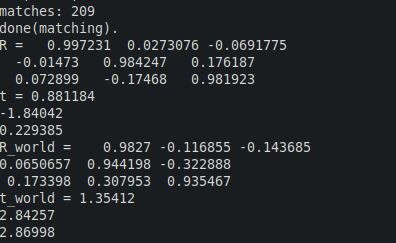

# Slam Final Project

A repo for the final project of SLAM study by **Dr.Gao Xiang**.  
Supervised by **Mr.Xiao**.  
Update tiem: **2019.9.11**  

## Project Structure

*  **SlamWork**: Body class of all the features. It contains the following classes.
*  **DepthGenerator**: Generate the depth from stereo images.  
*  **OrbMatcher**: Match the neighbor frames.  
*  **IcpTranslator**: Generate the R and T between neighbor poses.  

## Sample

**sample_00** is a sample short cut from the datasets of **kitti** ordometry sequence 00.  

**final_project.cc** supplies a sample of this **SlamWork** implement. 

```
#include "slam_work.h"

int main(int argc, char** argv) {
	std::cout << "Please input like this: /path/to/kitti/sequence/ fx fy cx cy baseline number_of_frames"<< std::endl;
	SlamWork slam_work;
	std::string fx(*(argv+2)),fy(*(argv+3)),cx(*(argv+4)),cy(*(argv+5)),baseline(*(argv+6));
	std::cout << "fx = " << std::stof(fx) << std::endl;
	std::cout << "fy = " << std::stof(fy) << std::endl;
	std::cout << "cx = " << std::stof(cx) << std::endl;
	std::cout << "cy = " << std::stof(cy) << std::endl;
	std::cout << "stereo baseline = " << std::stof(baseline) << std::endl;
	slam_work.SetParams(std::stof(fx), std::stof(fy), std::stof(cx), std::stof(cy),std::stof(baseline));// 718.856, 718.856, 607.1928, 185.2157, 0.537166 // Input manually.
	std::string in_path = *(argv+1);
	slam_work.input_path_ = in_path;
	std::cout << "kitti dir = " << slam_work.input_path_ << std::endl;
	std::string num_frames(*(argv+7));
	slam_work.pose_number_ = std::stoi(num_frames);
	std::cout << "number of frames = " << slam_work.pose_number_  << std::endl;
	slam_work.R_world_ << 1,0,0,0,1,0,0,0,1;
	slam_work.t_world_ << 0,0,0;
	slam_work.ComputePose();
	return 0;
}
```


 ## Run the Demo
The arguments are: **input_path fx fy cx cy baseline number_of_frames**
Use the following commands to build & run the **final_project**.

```  
mkdir build 
cd build
cmake ..
make
./final_project ../sample_00/ 718.856 718.856 607.1928 185.2157 0.537166 10
```

## Result



Output now are the infos printed at the console. 

**R_world**: The R matrix from the present to the first.

**t_world**: The t vector from the present to the first.  

## Problems & Future work
It seems that the ICP result is not so stable. And the BA and other backend functions have not been established.  
I will study the codes in **slambook2/ch13** which clearly implemented a good example of stereo slam of kitti.  
Thanks again for dear teachers **Dr.Gao Xiang** and **Mr.Xiao**.  


